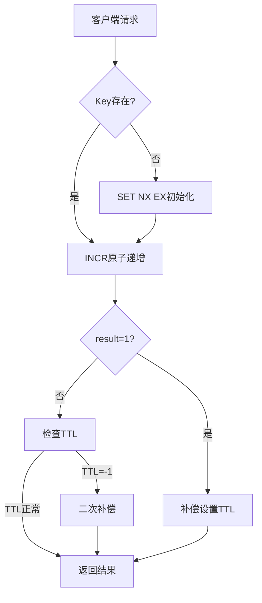

大部分互联网公司都需要处理计数器场景，例如风控系统的请求频控、内容平台的播放量统计、电商系统的库存扣减等。

传统方案一般会直接使用`RedisUtil.incr(key)`，这是最简单的方式，但这种方式在生产环境中会暴露严重问题：

```java
// 隐患示例
public long addOne(String key) {
    Long result = RedisUtil.incr(key); 
    // 若未设置TTL，key将永久驻留内存
    return result;
}
```

> INCR 有**自动初始化机制**，即当 Redis 检测到目标 key 不存在时，会**自动将其初始化为 0**，再执行递增操作


## 高可用计数器的实现

### 原子操作保障计数准确性

#### NX+EX 原子初始化

```java
RedisUtil.set(key, "0", "nx", "ex", time);
```

通过Redis的`SET key value NX EX`命令，实现原子化的"不存在即创建+**设置过期时间**"，避免多个线程竞争初始化导致数据覆盖（如线程A初始化后，线程B用SET覆盖值为0）

Redis单线程模型保证命令原子性，无需额外分布式锁

使用setnx命令来设置了过期时间，防止key永不过期


#### INCR 原子递增

```java
long result = RedisUtil.incr(key);
```

先setnx命令后，再使用INCR来执行递增操作

即：

```java
public void addOne(String key) {
    RedisUtil.set(key, "0", "nx", "ex", time);
    Long result = RedisUtil.incr(key); 
	return result;
}
```


### 双重补偿机制解决过期异常

但只是使用以上两个命令还是有可能导致并发安全问题。

例如：

当两个线程同时执行 SETNX 时，未抢到初始化的线程直接执行INCR，导致key存在但无TTL

如果有一个线程A正在执行`SET key 0 NX EX 60` ，而线程B也执行方法addOne，此时线程A正在执行，线程B无法执行set操作，会直接继续执行后续命令（如 INCR），此时若线程A由于网络抖动等原因初始化key失败，那就有可能导致 key 永不过期。因此需要有补偿机制，完成redis key超时时间的设置

> 注意：当 SETNX 命令无法执行（即目标 key 已存在时），会直接继续执行后续命令（如 INCR），而不会阻塞等待


#### 首次递增补偿

因此可以通过判断`result == 1`来识别是否是首次递增，如果是首次递增的话，则强制续期

```java
if (result == 1) {
    RedisUtil.expire(key, time);
}
```


#### TTL异常检测补偿

在**极端场景**下(Redis主从切换、命令执行异常导致TTL丢失)，key 可能因未设置或过期时间丢失而长期存在

```java
if (RedisUtil.ttl(key) == -1) {
    RedisUtil.expire(key, time);
}
```

检查 TTL 是否为 `-1`（-1表示无过期时间），重新设置过期时间，作为兜底保护。


经过双重补偿机制后的代码如下：

```java
public void addOne(String key) {
    RedisUtil.set(key, "0", "nx", "ex", time);
    Long result = RedisUtil.incr(key); 
    //解决并发问题，否则会导致计数器永不清空
    //如果incr的结果为1，有两个结果，先进行set操作，此时有过期时间。第二种：直接执行incr操作，此时的redisKey没有过期时间。所以需要补偿处理
    if (result == 1) {
         RedisUtil.expire(key, time);
    }

    // 检查是否有过期时间， 对异常没有设置过期时间的key补偿
    if (RedisUtil.ttl(key) == -1) {
         RedisUtil.expire(key, time);
    }
    return result;
}
```


### 异常处理与降级策略

有时候可能会因网络抖动、服务短暂不可用、主备切换等**暂时性故障**，导致Redis操作失败，因此可以对这中异常进行处理，将需要完成的操作放入到队列中，再使用一个线程循环重试，保证最终一致性

```java
public void addOne(String key) {
    Long result = 1;
    try{
        RedisUtil.set(key, "0", "nx", "ex", time);
        result = RedisUtil.incr(key); 
        //解决并发问题，否则会导致计数器永不清空
        //如果incr的结果为1，有两个结果，先进行set操作，此时有过期时间。第二种：直接执行incr操作，此时的redisKey没有过期时间。所以需要补偿处理
        if (result == 1) {
             RedisUtil.expire(key, time);
        }

        // 检查是否有过期时间， 对异常没有设置过期时间的key补偿
        if (RedisUtil.ttl(key) == -1) {
             RedisUtil.expire(key, time);
        }
    } catch (Exception e) {
        //丢到重试队列中，一直重试
    	queue.offer(key); 
	}
    return result;
}
```


## 架构设计示意图




## 关键机制对比

| 机制         | 解决的问题           | Redis特性利用    | 性能影响    |
| ------------ | -------------------- | ---------------- | ----------- |
| SET NX EX    | 并发初始化竞争       | 原子单命令       | O(1)        |
| INCR         | 计数不准确/超卖      | 原子递增         | O(1)        |
| TTL双重补偿  | Key永不过期          | EXPIRE命令幂等性 | 额外1次查询 |
| 异常队列重试 | 网络抖动/Redis不可用 | 最终一致性       | 异步处理    |


这个方案充分挖掘了Redis原子命令的潜力，通过补偿机制弥补分布式系统的不确定性，最终在简单与可靠之间找到平衡点。


## 扩展：Redisson实现滑动窗口计数

本方案是通过 **ZSet** 和 **Lua 脚本**来实现的分布式滑动窗口计数器。

核心思想是**将每个请求的时间戳作为分数存入 ZSet，通过计算某个时间区间内的元素数量来统计请求次数，并利用 Lua 脚本保证整个‘清理过期数据-计数-添加新记录’流程的原子性**，非常适合在分布式环境下进行精准的限流和统计。

Key 的组成是 `sliding:counter:{baseKey}:{windowSizeInMillis}`。固定前缀:业务相关key:时间窗口。这里**将窗口大小作为 Key 的一部分是关键**，这样同一个业务标识（如 `user123`）可以同时拥有多个不同时间粒度的计数器

value 的构成（ZSet 中的元素）：取决于调用的方法，做了两种不同的计数场景：

- **普通计数（`increment`方法）**：
    - **Member（成员）**：`{currentTime}_{UUID}`。例如：`1766863205000_550e8400-e29b-41d4-a716-446655440000`。
    - **Score（分数）**：当前的毫秒时间戳，即 `currentTime`。
    - **设计意图**：使用 **时间戳+UUID** 是为了确保每个请求记录的**唯一性**，避免在高并发下同一毫秒内的多个请求因 Member 相同而被覆盖，从而导致计数不准。
        
- **唯一值计数（`addUniqueItem`方法）**：
    - **Member（成员）**：直接使用业务上的唯一标识，如酒店ID `hotel_456`。
    - **设计意图**：对于同一个 Member（如 `hotel_456`），后续的 `ZADD`操作会**更新其 Score 为最新时间**。这使得 ZSet 能自动维护每个唯一项的最新访问时间，并且 `ZCARD`命令可以直接返回唯一项的数量，完美实现了“统计不同数据的个数”的需求。


```java
import org.redisson.api.RScoredSortedSet;
import org.redisson.api.RScript;
import org.redisson.api.RedissonClient;
import org.redisson.client.codec.StringCodec;
import org.springframework.stereotype.Component;

import java.util.Collections;
import java.util.UUID;
import java.util.concurrent.TimeUnit;

/**
 * 分布式滑动窗口计数器 - Redisson实现
 * 支持普通计数和唯一值计数两种模式
 */
@Component
public class SlidingWindowCounter {
    
    private final RedissonClient redissonClient;
    
    // Lua脚本SHA1缓存（脚本预加载）
    private String incrementScriptSha1;
    private String uniqueItemScriptSha1;
    
    // Key前缀
    private static final String KEY_PREFIX = "sliding:counter:";
    
    public SlidingWindowCounter(RedissonClient redissonClient) {
        this.redissonClient = redissonClient;
        // 预加载Lua脚本
        preloadScripts();
    }
    
    /**
     * 预加载Lua脚本到Redis服务器
     */
    private void preloadScripts() {
        // 普通计数Lua脚本
        String incrementScript = 
            "local key = KEYS[1] " +
            "local currentTime = tonumber(ARGV[1]) " +
            "local windowSize = tonumber(ARGV[2]) " +
            "local uuid = ARGV[3] " +
            "local expireTime = tonumber(ARGV[4]) " +
            " " +
		    //计算窗口开始时间
            "local windowStart = currentTime - windowSize " +
            " " +
            //删除过期数据
            "redis.call('ZREMRANGEBYSCORE', key, 0, windowStart) " +
            " " +
            //添加当前请求记录
            "local member = currentTime .. '_' .. uuid " +
            "redis.call('ZADD', key, currentTime, member) " +
            " " +
            //设置过期时间
            "redis.call('EXPIRE', key, expireTime) " +
            " " +
            //返回当前窗口内的请求数量
            "return redis.call('ZCARD', key)";
        
        // 唯一值计数Lua脚本
        String uniqueItemScript = 
            "local key = KEYS[1] " +
            "local currentTime = tonumber(ARGV[1]) " +
            "local windowSize = tonumber(ARGV[2]) " +
            "local uniqueValue = ARGV[3] " +
            "local expireTime = tonumber(ARGV[4]) " +
            " " +
            //计算窗口开始时间
            "local windowStart = currentTime - windowSize " +
            " " +
            //删除过期数据
            "redis.call('ZREMRANGEBYSCORE', key, 0, windowStart) " +
            " " +
            //添加或更新唯一值
            "redis.call('ZADD', key, currentTime, uniqueValue) " +
            " " +
            //设置过期时间
            "redis.call('EXPIRE', key, expireTime) " +
            " " +
            //返回当前窗口内的唯一值数量
            "return redis.call('ZCARD', key)";
        
        // 脚本预加载
        RScript script = redissonClient.getScript(StringCodec.INSTANCE);
        incrementScriptSha1 = script.scriptLoad(incrementScript);
        uniqueItemScriptSha1 = script.scriptLoad(uniqueItemScript);
    }
    
    /**
     * 普通计数 - 每个请求都会增加计数
     * @param baseKey 业务基础key，如"user:123"
     * @param windowSize 窗口大小（毫秒）
     * @param expireSeconds 过期时间（秒），建议 >= windowSize/1000
     * @return 当前窗口内的请求数量
     */
    public long increment(String baseKey, long windowSize, long expireSeconds) {
        String key = buildKey(baseKey, windowSize);
        long currentTime = System.currentTimeMillis();
        String uuid = UUID.randomUUID().toString();
        
        try {
            // 使用EVALSHA执行预加载的脚本
            RScript script = redissonClient.getScript(StringCodec.INSTANCE);
            return script.evalSha(RScript.Mode.READ_WRITE, 
                incrementScriptSha1, 
                RScript.ReturnType.INTEGER, 
                Collections.singletonList(key),
                currentTime, windowSize, uuid, expireSeconds);
        } catch (Exception e) {
            // 如果脚本不存在，重新加载（容错处理）
            if (e.getMessage().contains("NOSCRIPT")) {
                preloadScripts();
                return increment(baseKey, windowSize, expireSeconds);
            }
            throw new RuntimeException("滑动窗口计数失败", e);
        }
    }
    
    /**
     * 唯一值计数 - 统计窗口内不同数据的个数
     * @param baseKey 业务基础key
     * @param uniqueValue 唯一值，如酒店ID "hotel_456"
     * @param windowSize 窗口大小（毫秒）
     * @param expireSeconds 过期时间（秒）
     * @return 当前窗口内的唯一值数量
     */
    public long addUniqueItem(String baseKey, String uniqueValue, long windowSize, long expireSeconds) {
        String key = buildKey(baseKey, windowSize);
        long currentTime = System.currentTimeMillis();
        
        try {
            RScript script = redissonClient.getScript(StringCodec.INSTANCE);
            return script.evalSha(RScript.Mode.READ_WRITE, 
                uniqueItemScriptSha1, 
                RScript.ReturnType.INTEGER, 
                Collections.singletonList(key),
                currentTime, windowSize, uniqueValue, expireSeconds);
        } catch (Exception e) {
            if (e.getMessage().contains("NOSCRIPT")) {
                preloadScripts();
                return addUniqueItem(baseKey, uniqueValue, windowSize, expireSeconds);
            }
            throw new RuntimeException("唯一值计数失败", e);
        }
    }
    
    /**
     * 获取当前窗口计数（不增加计数）
     * @param baseKey 业务基础key
     * @param windowSize 窗口大小
     * @return 当前计数
     */
    public long getCurrentCount(String baseKey, long windowSize) {
        String key = buildKey(baseKey, windowSize);
        RScoredSortedSet<String> scoredSet = redissonClient.getScoredSortedSet(key, StringCodec.INSTANCE);
        
        long windowStart = System.currentTimeMillis() - windowSize;
        // 删除过期数据并返回当前数量
        scoredSet.removeRangeByScore(0, true, windowStart, false);
        return scoredSet.size();
    }
    
    /**
     * 获取唯一值当前计数（不增加计数）
     * @param baseKey 业务基础key
     * @param windowSize 窗口大小
     * @return 唯一值数量
     */
    public long getUniqueCount(String baseKey, long windowSize) {
        // 实现同getCurrentCount，因为存储结构相同
        return getCurrentCount(baseKey, windowSize);
    }
    
    /**
     * 清理指定key的计数数据
     * @param baseKey 业务基础key
     * @param windowSize 窗口大小
     */
    public void clear(String baseKey, long windowSize) {
        String key = buildKey(baseKey, windowSize);
        redissonClient.getKeys().delete(key);
    }
    
    /**
     * 构建Redis Key
     */
    private String buildKey(String baseKey, long windowSize) {
        return KEY_PREFIX + baseKey + ":" + windowSize;
    }
}
```


其它设计亮点：

- **原子性保证**：强调为什么使用 **Lua 脚本**而不是多个独立的 Redis 命令。因为在高并发场景下，如果“清理-判断-添加”不是原子操作，可能会出现竞态条件，导致计数超限。Lua 脚本在 Redis 中单线程执行，完美解决了这个问题。同时能减少网络io，减少redis的qps次数
- **性能优化**：**脚本预加载**。在类初始化时（构造函数中）就通过 `SCRIPT LOAD`将 Lua 脚本加载到 Redis 并缓存其 SHA1 摘要。后续调用使用 `EVALSHA`而不是直接发送脚本内容，大大减少了网络传输开销，提升了性能。
- **应对高并发**：在普通计数场景下使用 **“时间戳+UUID”** 来防止成员覆盖。
- **两种模式**：实现两种方法（累计计数 vs. 唯一值计数），这比单一的计数器更具实用性。


