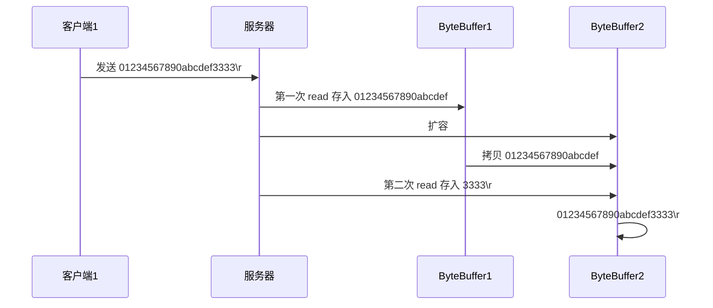

## 流与块

Standard IO是对字节流的读写，在进行IO之前，首先创建一个流对象，流对象进行读写操作都是按字节 ，一个字节一个字节的来读或写。而NIO把IO抽象成块，类似磁盘的读写，每次IO操作的单位都是一个块，块被读入内存之后就是一个byte[]，NIO一次可以读或写多个字节。

I/O 与 NIO 最重要的区别是数据打包和传输的方式，I/O 以流的方式处理数据，而 NIO 以块的方式处理数据。

面向流的 I/O 一次处理一个字节数据: 一个输入流产生一个字节数据，一个输出流消费一个字节数据。为流式数据创建过滤器非常容易，链接几个过滤器，以便每个过滤器只负责复杂处理机制的一部分。不利的一面是，面向流的 I/O 通常相当慢。

面向块的 I/O 一次处理一个数据块，按块处理数据比按流处理数据要快得多。但是面向块的 I/O 缺少一些面向流的 I/O 所具有的优雅性和简单性。

I/O 包和 NIO 已经很好地集成了，`java.io.*` 已经以 NIO 为基础重新实现了，所以现在它可以利用 NIO 的一些特性。例如，`java.io.*` 包中的一些类包含以块的形式读写数据的方法，这使得即使在面向流的系统中，处理速度也会更快。

## Java对[IO多路复用](https://www.seven97.top/cs-basics/operating-system/selectpollepoll.html)的支持

NIO 常常被叫做非阻塞 IO，主要是因为 NIO 在网络通信中的非阻塞特性被广泛使用。但其实应该叫new IO，是相较于传统IO来说的。


Java NIO 中的 `Selector` 类是基于操作系统提供的 I/O 多路复用机制实现的，而在 Linux 上，这个机制就是 `epoll`。

关于触发模式，Java NIO 的 `Selector` 默认使用的是水平触发模式（Level-Triggered, LT）。这意味着当一个文件描述符（在 Java 中通常是 `SocketChannel` 或 `ServerSocketChannel`）变得可读或可写时，`Selector` 会持续通知，直到该文件描述符上的事件被处理。这与 `epoll` 的水平触发模式是一致的。

虽然 `epoll` 也支持边缘触发模式（Edge-Triggered, ET），但 Java NIO 的 `Selector` 并没有直接提供对边缘触发模式的支持。如果需要使用边缘触发模式，通常需要直接使用底层的系统调用（如通过 JNI 调用 `epoll` 的边缘触发模式），但这超出了标准 Java NIO 库的范围。

总结一下：

- Java NIO 在 Linux 上使用 `epoll` 作为底层的 I/O 多路复用机制。
- Java NIO 的 `Selector` 默认使用 `epoll` 的水平触发模式。
- Java NIO 不直接支持 `epoll` 的边缘触发模式，需要通过其他方式实现。

因此，如果你在 Linux 上使用 Java NIO 的 `Selector`，你可以预期它使用的是 [`epoll` 的水平触发模式](https://www.seven97.top/cs-basics/operating-system/selectpollepoll.html#水平触发)。


## 三大组件

### 通道

被建立的一个应用程序和操作系统交互事件、传递内容的渠道(注意是连接到操作系统)。一个通道会有一个专属的文件状态描述符。那么既然是和操作系统进行内容的传递，那么说明应用程序可以通过通道读取数据，也可以通过通道向操作系统写数据。

通道 Channel 是对原 I/O 包中的流的模拟，可以通过它读取和写入数据。通道与流的不同之处在于，流只能在一个方向上移动(一个流必须是 InputStream 或者 OutputStream 的子类)，而通道是双向的，可以用于读、写或者同时用于读写。

JAVA NIO 框架中，自有的Channel通道包括:


所有被Selector(选择器)注册的通道，只能是继承了SelectableChannel类的子类。如上图所示

- FileChannel: 从文件中读写数据；

- DatagramChannel: 通过 UDP 读写网络中数据；

- SocketChannel: TCP Socket套接字的监听通道，一个Socket套接字对应了一个客户端IP: 端口 到 服务器IP: 端口的通信连接。

- ServerSocketChannel: 应用服务器程序的监听通道。只有通过这个通道，应用程序才能向操作系统注册支持“多路复用IO”的端口监听。同时支持UDP协议和TCP协议。

FileChannel 是磁盘IO的通道，后三个是网络IO的通道。并且FileChannel不能切换为非阻塞模式，因此FileChannel不适合Selector。


### 缓冲区

数据缓存区: 在JAVA NIO 框架中，为了保证每个通道的数据读写速度JAVA NIO 框架为每一种需要支持数据读写的通道集成了Buffer的支持。用于读取或写入数据到通道。

这句话怎么理解呢? 例如ServerSocketChannel通道它只支持对OP_ACCEPT事件的监听，所以它是不能直接进行网络数据内容的读写的。所以ServerSocketChannel是没有集成Buffer的。

Buffer有两种工作模式: 写模式和读模式。在读模式下，应用程序只能从Buffer中读取数据，不能进行写操作。但是在写模式下，应用程序是可以进行读操作的，这就表示可能会出现脏读的情况。所以一旦您决定要从Buffer中读取数据，一定要将Buffer的状态改为读模式。

发送给一个通道的所有数据都必须首先放到缓冲区中，同样地，从通道中读取的任何数据都要先读到缓冲区中。也就是说，不会直接对通道进行读写数据，而是要先经过缓冲区。

缓冲区实质上是一个数组，但它不仅仅是一个数组。缓冲区提供了对数据的结构化访问，而且还可以跟踪系统的读/写进程。

缓冲区包括以下类型:

- ByteBuffer

- CharBuffer

- ShortBuffer

- IntBuffer

- LongBuffer

- FloatBuffer

- DoubleBuffer


####   ByteBuffer 正确使用姿势

1. 向 buffer 写入数据，例如调用 channel.read(buffer)
2. 调用 flip() 切换至**读模式**
3. 从 buffer 读取数据，例如调用 buffer.get()
4. 调用 clear() 或 compact() 切换至**写模式**
5. 重复 1~4 步骤


ByteBuffer 大小分配：

* 每个 channel 都需要记录可能被切分的消息，因为 ByteBuffer 不能被多个 channel 共同使用，因此需要为每个 channel 维护一个独立的 ByteBuffer
* ByteBuffer 不能太大，比如一个 ByteBuffer 1Mb 的话，要支持百万连接就要 1Tb 内存，因此需要设计大小可变的 ByteBuffer
  * 一种思路是首先分配一个较小的 buffer，例如 4k，如果发现数据不够，再分配 8k 的 buffer，将 4k buffer 内容拷贝至 8k buffer，优点是消息连续容易处理，缺点是数据拷贝耗费性能，参考实现 [http://tutorials.jenkov.com/java-performance/resizable-array.html](http://tutorials.jenkov.com/java-performance/resizable-array.html)
  * 另一种思路是用多个数组组成 buffer，一个数组不够，把多出来的内容写入新的数组，与前面的区别是消息存储不连续解析复杂，优点是避免了拷贝引起的性能损耗


#### 缓冲区状态变量

- capacity: 最大容量；

- position: 当前已经读写的字节数；

- limit: 还可以读写的字节数。

状态变量的改变过程举例:

① 新建一个大小为 8 个字节的缓冲区，此时 position 为 0，而 limit = capacity = 8。capacity 变量不会改变，下面的讨论会忽略它。


② 从输入通道中读取 5 个字节数据写入缓冲区中，此时 position 移动设置为 5，limit 保持不变。


③ 在将缓冲区的数据写到输出通道之前，需要先调用 flip() 方法，这个方法将 limit 设置为当前 position，并将 position 设置为 0。
写到输出通道，意味着要从buffer中读出，才能写入channel

```java
public Buffer flip() {
     limit = position;
     position = 0;
     mark = -1;
     return this;
}
```


④ 从缓冲区中取 4 个字节到输出缓冲中，此时 position 设为 4。


⑤ 最后需要调用 clear() 方法来清空缓冲区，此时 position 和 limit 都被设置为最初位置。


⑥ compact 方法，是把未读完的部分向前压缩，然后切换至写模式


#### 文件 NIO 实例

以下展示了使用 NIO 快速复制文件的实例:

```java
public static void fastCopy(String src, String dist) throws IOException {

    /* 获得源文件的输入字节流 */
    FileInputStream fin = new FileInputStream(src);

    /* 获取输入字节流的文件通道 */
    FileChannel fcin = fin.getChannel();

    /* 获取目标文件的输出字节流 */
    FileOutputStream fout = new FileOutputStream(dist);

    /* 获取输出字节流的通道 */
    FileChannel fcout = fout.getChannel();

    /* 为缓冲区分配 1024 个字节 */
    ByteBuffer buffer = ByteBuffer.allocateDirect(1024);

    while (true) {

        /* 从输入通道中读取数据到缓冲区中 */
        int r = fcin.read(buffer);//对于buffer来说，这是写入的过程

        /* read() 返回 -1 表示 EOF */
        if (r == -1) {
            break;
        }

        /* 切换读写 */
        buffer.flip();

        /* 把缓冲区的内容写入输出文件中 */
        fcout.write(buffer);//对于buffer来说，这是读取的过程
        
        /* 清空缓冲区 */
        buffer.clear();
    }
}
```


### 选择器

Selector (选择器，多路复用器)是JavaNIO 中能够检测一到多个NIO通道，是否为诸如读写事件做好准备的组件。这样，一个单独的线程可以管理多个channel，从而管理多个网络连接。

NIO 实现了 [IO 多路复用中的 多Reactor多进程/线程 模型](https://www.seven97.top/cs-basics/operating-system/reactor-proactor.html#多-reactor-多进程-线程)，一个线程 Thread 使用一个选择器 Selector 通过轮询的方式去监听多个通道 Channel 上的事件，从而让一个线程就可以处理多个事件。通过配置监听的通道 Channel 为非阻塞，那么当 Channel 上的 IO 事件还未到达时，就不会进入阻塞状态一直等待，而是继续轮询其它 Channel，找到 IO 事件已经到达的 Channel 执行。

因为创建和切换线程的开销很大，因此使用一个线程来处理多个事件而不是一个线程处理一个事件具有更好的性能。


- 事件订阅和Channel管理：应用程序将向Selector对象注册需要它关注的Channel，以及具体的某一个Channel会对哪些IO事件感兴趣。Selector中也会维护一个“已经注册的Channel”的容器。以下代码来自WindowsSelectorImpl实现类中，对已经注册的Channel的管理容器:

```java
// Initial capacity of the poll array
private final int INIT_CAP = 8;
// Maximum number of sockets for select().
// Should be INIT_CAP times a power of 2
private final static int MAX_SELECTABLE_FDS = 1024;

// The list of SelectableChannels serviced by this Selector. Every mod
// MAX_SELECTABLE_FDS entry is bogus, to align this array with the poll
// array,  where the corresponding entry is occupied by the wakeupSocket
private SelectionKeyImpl[] channelArray = new SelectionKeyImpl[INIT_CAP];

```

- 轮询代理：应用层不再通过阻塞模式或者非阻塞模式直接询问操作系统“事件有没有发生”，而是由Selector代其询问。
- 实现不同操作系统的支持：多路复用IO技术 是需要操作系统进行支持的，其特点就是操作系统可以同时扫描同一个端口上不同网络连接的事件。所以作为上层的JVM，必须要为 不同操作系统的多路复用IO实现 编写不同的代码。同样测试环境是Windows，它对应的实现类是sun.nio.ch.WindowsSelectorImpl:


selector 的作用就是配合一个线程来管理多个 channel，获取这些 channel 上发生的事件，这些 channel 工作在非阻塞模式下，不会让线程吊死在一个 channel 上。适合连接数特别多，但流量低的场景（low traffic）


 

#### 创建选择器

```java
Selector selector = Selector.open();
```


#### 绑定 Channel 事件

也称之为注册事件，绑定的事件 selector 才会关心 

```java
ServerSocketChannel ssChannel = ServerSocketChannel.open();
ssChannel.configureBlocking(false);
ssChannel.register(selector, SelectionKey.OP_ACCEPT);
```

Channel必须配置为非阻塞模式，否则使用选择器就没有任何意义了，因为如果通道在某个事件上被阻塞，那么服务器就不能响应其它事件，必须等待这个事件处理完毕才能去处理其它事件，显然这和选择器的作用背道而驰。

在将通道注册到选择器上时，还需要指定要注册的具体事件，主要有以下几类:

- SelectionKey.OP_CONNECT

- SelectionKey.OP_ACCEPT

- SelectionKey.OP_READ

- SelectionKey.OP_WRITE

它们在 SelectionKey 的定义如下:

```java
public static final int OP_READ = 1 << 0;
public static final int OP_WRITE = 1 << 2;
public static final int OP_CONNECT = 1 << 3;
public static final int OP_ACCEPT = 1 << 4;
```

可以看出每个事件可以被当成一个位域，从而组成事件集整数。例如:

```java
int interestSet = SelectionKey.OP_READ | SelectionKey.OP_WRITE;
```


#### 监听事件

- 方法1，阻塞直到绑定事件发生

```java
int count = selector.select();
```


- 方法2，阻塞直到绑定事件发生，或是超时（时间单位为 ms）

```java
int count = selector.select(long timeout);
```


- 方法3，不会阻塞，也就是不管有没有事件，立刻返回，自己根据返回值检查是否有事件

```java
int count = selector.selectNow();
```

使用 select() 来监听到达的事件，它会一直阻塞直到有至少一个事件到达。

那 select 何时不阻塞：

- 事件发生时
  - 客户端发起连接请求，会触发 accept 事件
  - 客户端发送数据过来，客户端正常、异常关闭时，都会触发 read 事件，另外如果发送的数据大于 buffer 缓冲区，会触发多次读取事件
  - channel 可写，会触发 write 事件
  - 在 linux 下 nio bug 发生时
- 调用 selector.wakeup()
- 调用 selector.close()
- selector 所在线程 interrupt


#### 处理accept事件

```java
// 获取所有事件
Set<SelectionKey> keys = selector.selectedKeys();
// 遍历所有事件，逐一处理
Iterator<SelectionKey> keyIterator = keys.iterator();
while (keyIterator.hasNext()) {
    SelectionKey key = keyIterator.next();
    // 判断事件类型
    if (key.isAcceptable()) {
        ServerSocketChannel c = (ServerSocketChannel) key.channel();
        // 必须处理
        SocketChannel sc = c.accept();
        sc.configureBlocking(false);
        sc.register(selector, SelectionKey.OP_READ);
        // ...
    } 
    // 处理完毕，必须将事件移除
    keyIterator.remove();
}
```

事件发生后，能否不处理？
不能，事件发生后，要么处理，要么取消（cancel），不能什么都不做，否则下次该事件仍会触发，这是因为 nio 底层使用的是水平触发

这里为什么要 keyIterator.remove() 操作？ 
因为 select 在事件发生后，就会将相关的 key 放入 selectedKeys 集合，但不会在处理完后从 selectedKeys 集合中移除，需要我们自己编码删除。例如

- 第一次触发了 ssckey 上的 accept 事件，没有移除 ssckey 
- 第二次触发了 sckey 上的 read 事件，但这时 selectedKeys 中还有上次的 ssckey ，在处理时因为没有真正的 serverSocket 连上了，就会导致空指针异常


#### 处理 read 事件

```java
// 获取所有事件
Set<SelectionKey> keys = selector.selectedKeys();
// 遍历所有事件，逐一处理
Iterator<SelectionKey> keyIterator = keys.iterator();
while (keyIterator.hasNext()) {
    SelectionKey key = keyIterator.next();
    // 判断事件类型
    if (key.isAcceptable()) {
        ServerSocketChannel c = (ServerSocketChannel) key.channel();
        // 必须处理
        SocketChannel sc = c.accept();
        sc.configureBlocking(false);
        sc.register(selector, SelectionKey.OP_READ);
        // ...
    } else if (key.isReadable()) {
        SocketChannel sc = (SocketChannel) key.channel();
        //实际使用中，不会一次给buffer缓冲区分配太多空间，因此可能存在粘包的问题
        ByteBuffer buffer = ByteBuffer.allocate(128);
        int read = sc.read(buffer);
        if(read == -1) {
            key.cancel();
            sc.close();
        } else {
            buffer.flip();
        }
    }
    // 处理完毕，必须将事件移除
    keyIterator.remove();
}
```

 cancel 的作用？ cancel 会取消注册在 selector 上的 channel，并从 keys 集合中删除 key 后续不会再监听事件


##### 处理消息的边界




```java
// 获取所有事件
Set<SelectionKey> keys = selector.selectedKeys();
// 遍历所有事件，逐一处理
Iterator<SelectionKey> keyIterator = keys.iterator();
while (keyIterator.hasNext()) {
    SelectionKey key = keyIterator.next();
    // 判断事件类型
    if (key.isAcceptable()) {
        ServerSocketChannel c = (ServerSocketChannel) key.channel();
        // 必须处理
        SocketChannel sc = c.accept();
        sc.configureBlocking(false);
        ByteBuffer buffer = ByteBuffer.allocate(16); // attachment
        // 将一个 byteBuffer 作为附件关联到 selectionKey 上
        SelectionKey scKey = sc.register(selector, 0, buffer);
        scKey.register(selector, SelectionKey.OP_READ);
    } else if (key.isReadable()) { // 如果是 read
        try {
            SocketChannel sc = (SocketChannel) key.channel();
            // 获取 selectionKey 上关联的附件
            ByteBuffer buffer = (ByteBuffer) key.attachment();
            int read = sc.read(buffer);
            if(read == -1) {
                key.cancel();
            } else {
                split(buffer);
                // 需要扩容
                if (buffer.position() == buffer.limit()) {
                    ByteBuffer newBuffer = ByteBuffer.allocate(buffer.capacity() * 2);
                    buffer.flip();
                    newBuffer.put(buffer); // 0123456789abcdef3333\n
                    key.attach(newBuffer);
                }
            } catch (IOException e) {
                e.printStackTrace();
                key.cancel();  // 因为客户端断开了,因此需要将 key 取消（从 selector 的 keys 集合中真正删除 key）
            }
    }
    // 处理完毕，必须将事件移除
    keyIterator.remove();
}
```

split 方法

```java
private static void split(ByteBuffer source) {
    source.flip();
    for (int i = 0; i < source.limit(); i++) {
        // 找到一条完整消息
        if (source.get(i) == '\n') {
            int length = i + 1 - source.position();
            // 把这条完整消息存入新的 ByteBuffer
            ByteBuffer target = ByteBuffer.allocate(length);
            // 从 source 读，向 target 写
            for (int j = 0; j < length; j++) {
                target.put(source.get());
            }
            debugAll(target);
        }
    }
    source.compact(); // 0123456789abcdef  position 16 limit 16
}
```


#### 处理 write 事件

##### 一次无法写完的例子

* 非阻塞模式下，无法保证把 buffer 中所有数据都写入 channel，因此需要追踪 write 方法的返回值（代表实际写入的字节数）
* 用 selector 监听所有 channel 的可写事件，每个 channel 都需要一个 key 来跟踪 buffer，但这样又会导致占用内存过多，就有两阶段策略
  * 当消息处理器第一次写入消息时，才将 channel 注册到 selector 上
  * selector 检查 channel 上的可写事件，如果所有的数据写完了，就取消 channel 的注册
  * 如果不取消，会每次可写均会触发 write 事件


```java
public class WriteServer {

    public static void main(String[] args) throws IOException {
        ServerSocketChannel ssc = ServerSocketChannel.open();
        ssc.configureBlocking(false);
        ssc.bind(new InetSocketAddress(8080));

        Selector selector = Selector.open();
        ssc.register(selector, SelectionKey.OP_ACCEPT);

        while(true) {
            selector.select();

            Iterator<SelectionKey> iter = selector.selectedKeys().iterator();
            while (iter.hasNext()) {
                SelectionKey key = iter.next();
                iter.remove();
                if (key.isAcceptable()) {
                    SocketChannel sc = ssc.accept();
                    sc.configureBlocking(false);
                    SelectionKey sckey = sc.register(selector, SelectionKey.OP_READ);
                    // 1. 向客户端发送内容
                    StringBuilder sb = new StringBuilder();
                    for (int i = 0; i < 3000000; i++) {
                        sb.append("a");
                    }
                    ByteBuffer buffer = Charset.defaultCharset().encode(sb.toString());
                    int write = sc.write(buffer);
                    // 3. write 表示实际写了多少字节
                    System.out.println("实际写入字节:" + write);
                    // 4. 如果有剩余未读字节，才需要关注写事件
                    if (buffer.hasRemaining()) {
                        // read 1  write 4
                        // 在原有关注事件的基础上，多关注 写事件
                        //key.interestOps() 表示原有关注的时间，+  SelectionKey.OP_WRITE 写事件
                        sckey.interestOps(sckey.interestOps() + SelectionKey.OP_WRITE);
                        // 把 buffer 作为附件加入 sckey
                        sckey.attach(buffer);
                    }
                } else if (key.isWritable()) {
                    ByteBuffer buffer = (ByteBuffer) key.attachment();
                    SocketChannel sc = (SocketChannel) key.channel();
                    int write = sc.write(buffer);
                    System.out.println("实际写入字节:" + write);
                    if (!buffer.hasRemaining()) { // 写完了
                        // 为什么要取消关注 写事件
                        // 只要向 channel 发送数据时，socket 缓冲可写，这个事件会频繁触发，因此应当只在 socket 缓冲区写不下时再关注可写事件，数据写完之后应该取消关注
                        key.interestOps(key.interestOps() - SelectionKey.OP_WRITE);
                        key.attach(null);
                    }
                }
            }
        }
    }
}
```

客户端

```java
public class WriteClient {
    public static void main(String[] args) throws IOException {
        Selector selector = Selector.open();
        SocketChannel sc = SocketChannel.open();
        sc.configureBlocking(false);
        sc.register(selector, SelectionKey.OP_CONNECT | SelectionKey.OP_READ);
        sc.connect(new InetSocketAddress("localhost", 8080));
        int count = 0;
        while (true) {
            selector.select();
            Iterator<SelectionKey> iter = selector.selectedKeys().iterator();
            while (iter.hasNext()) {
                SelectionKey key = iter.next();
                iter.remove();
                if (key.isConnectable()) {
                    System.out.println(sc.finishConnect());
                } else if (key.isReadable()) {
                    ByteBuffer buffer = ByteBuffer.allocate(1024 * 1024);
                    count += sc.read(buffer);
                    buffer.clear();
                    System.out.println(count);
                }
            }
        }
    }
}
```


## 文件编程 FileChannel

FileChannel 只能工作在阻塞模式下，没有非阻塞模式

获取FileChannel 时，不能直接打开 FileChannel，必须通过 FileInputStream、FileOutputStream 或者 RandomAccessFile 来获取 FileChannel，它们都有 getChannel 方法

* 通过 FileInputStream 获取的 channel 只能读
* 通过 FileOutputStream 获取的 channel 只能写
* 通过 RandomAccessFile 是否能读写根据构造 RandomAccessFile 时的读写模式决定


### 两个 Channel 传输数据

```java
String FROM = "helloword/data.txt";
String TO = "helloword/to.txt";
long start = System.nanoTime();
try (FileChannel from = new FileInputStream(FROM).getChannel();
     FileChannel to = new FileOutputStream(TO).getChannel();
    ) {
    from.transferTo(0, from.size(), to);
} catch (IOException e) {
    e.printStackTrace();
}
long end = System.nanoTime();
System.out.println("transferTo 用时：" + (end - start) / 1000_000.0);//transferTo 用时：8.2011
```


### 超过 2g 大小的文件传输

```java
public class TestFileChannelTransferTo {
    public static void main(String[] args) {
        try (
                FileChannel from = new FileInputStream("data.txt").getChannel();
                FileChannel to = new FileOutputStream("to.txt").getChannel();
        ) {
            // 效率高，底层会利用操作系统的零拷贝进行优化
            long size = from.size();
            // left 变量代表还剩余多少字节
            for (long left = size; left > 0; ) {
                System.out.println("position:" + (size - left) + " left:" + left);
                left -= from.transferTo((size - left), left, to);
            }
        } catch (IOException e) {
            e.printStackTrace();
        }
    }
}
```

实际传输一个超大文件

```
position:0 left:7769948160
position:2147483647 left:5622464513
position:4294967294 left:3474980866
position:6442450941 left:1327497219
```

FileChannel.map()方法其实就是采用了操作系统中的[内存映射](https://www.seven97.top/cs-basics/operating-system/zerocopytechnology.html#mmap-write)方式，将内核缓冲区的内存和用户缓冲区的内存做了一个地址映射。它解决数据从磁盘读取到内核缓冲区，然后内核缓冲区的数据复制移动到用户空间缓冲区。程序还是需要从用户态切换到内核态，然后再进行操作系统调用，并且数据移动和复制了两次。


transferTo方法则是使用了[sendfile的方式](https://www.seven97.top/cs-basics/operating-system/zerocopytechnology.html#sendfile)，来分析一下其中原理：

- transferTo()方法直接将当前通道内容传输到另一个通道，没有涉及到Buffer的任何操作，NIO中的Buffer是JVM堆或者堆外内存，但不论如何他们都是操作系统内核空间的内存。也就是说这种方式不会有内核缓冲区和用户缓冲区之间的拷贝问题。
- transferTo()的实现方式就是通过系统调用sendfile()（当然这是Linux中的系统调用），根据我们上面所写说这个过程是效率远高于从内核缓冲区到用户缓冲区的读写的。
- 同理transferFrom()也是这种实现方式。

具体细节可以看这篇文章 [网络编程 - NIO的零拷贝实现](https://www.seven97.top/java/io/04-networkprogramming2-niozerocopy.html#filechannel)


## 网络编程

### JAVA NIO 框架简要设计分析

多路复用IO技术是操作系统的内核实现。在不同的操作系统，甚至同一系列操作系统的版本中所实现的多路复用IO技术都是不一样的。那么作为跨平台的JAVA JVM来说如何适应多种多样的多路复用IO技术实现呢? 面向对象的威力就显现出来了: 无论使用哪种实现方式，他们都会有“选择器”、“通道”、“缓存”这几个操作要素，那么可以为不同的多路复用IO技术创建一个统一的抽象组，并且为不同的操作系统进行具体的实现。JAVA NIO中对各种多路复用IO的支持，主要的基础是java.nio.channels.spi.SelectorProvider抽象类，其中的几个主要抽象方法包括:

- public abstract DatagramChannel openDatagramChannel(): 创建和这个操作系统匹配的UDP 通道实现。

- public abstract AbstractSelector openSelector(): 创建和这个操作系统匹配的NIO选择器，就像上文所述，不同的操作系统，不同的版本所默认支持的NIO模型是不一样的。

- public abstract ServerSocketChannel openServerSocketChannel(): 创建和这个NIO模型匹配的服务器端通道。

- public abstract SocketChannel openSocketChannel(): 创建和这个NIO模型匹配的TCP Socket套接字通道(用来反映客户端的TCP连接)

由于JAVA NIO框架的整个设计是很大的，所以我们只能还原一部分我们关心的问题。这里我们以JAVA NIO框架中对于不同多路复用IO技术的选择器 进行实例化创建的方式作为例子，以点窥豹观全局:


很明显，不同的SelectorProvider实现对应了不同的 选择器。由具体的SelectorProvider实现进行创建。另外说明一下，实际上netty底层也是通过这个设计获得具体使用的NIO模型。以下代码是Netty 4.0中NioServerSocketChannel进行实例化时的核心代码片段:

```java
private static ServerSocketChannel newSocket(SelectorProvider provider) {
    try {
        /**
            *  Use the {@link SelectorProvider} to open {@link SocketChannel} and so remove condition in
            *  {@link SelectorProvider#provider()} which is called by each ServerSocketChannel.open() otherwise.
            *
            *  See <a href="See https://github.com/netty/netty/issues/2308">#2308</a>.
            */
        return provider.openServerSocketChannel();
    } catch (IOException e) {
        throw new ChannelException(
                "Failed to open a server socket.", e);
    }
}

```


### JAVA实例 - 利用多线程优化

前面的代码只有一个选择器，没有充分利用多核 cpu。而现在都是多核 cpu，设计时要充分考虑别让 cpu 的力量被白白浪费

分两组选择器

* 单线程配一个选择器，专门处理 accept 事件
* 创建 cpu 核心数的线程，每个线程配一个选择器，轮流处理 read 事件


```java
public class ChannelDemo7 {
    public static void main(String[] args) throws IOException {
        new BossEventLoop().register();
    }


    @Slf4j
    static class BossEventLoop implements Runnable {
        private Selector boss;//只负责建立连接
        private WorkerEventLoop[] workers;//负责处理业务能力
        private volatile boolean start = false;
        AtomicInteger index = new AtomicInteger();

        public void register() throws IOException {
            if (!start) {
                ServerSocketChannel ssc = ServerSocketChannel.open();
                ssc.bind(new InetSocketAddress(8080));
                ssc.configureBlocking(false);
                //获取 boss 的选择器
                boss = Selector.open();
                //将ssc 绑定到boss的选择器
                SelectionKey ssckey = ssc.register(boss, 0, null);
                ssckey.interestOps(SelectionKey.OP_ACCEPT);
                workers = initEventLoops();
                //启动boss线程，接收accept事件
                new Thread(this, "boss").start();
                log.debug("boss start...");
                start = true;
            }
        }

        public WorkerEventLoop[] initEventLoops() {
         //Runtime.getRuntime().availableProcessors(可以拿到 cpu 个数
         //但是如果工作在 docker 容器下，因为容器不是物理隔离的，会拿到物理 cpu 个数，而不是容器申请时的个数
		// 这个问题直到 jdk 10 才修复，使用 jvm 参数 UseContainerSupport 配置， 默认开启
//        EventLoop[] eventLoops = new EventLoop[Runtime.getRuntime().availableProcessors()];
            //创建处理业务的线程
            WorkerEventLoop[] workerEventLoops = new WorkerEventLoop[2];
            for (int i = 0; i < workerEventLoops.length; i++) {
                workerEventLoops[i] = new WorkerEventLoop(i);
            }
            return workerEventLoops;
        }

        @Override
        public void run() {
            while (true) {
                try {
                    boss.select();
                    Iterator<SelectionKey> iter = boss.selectedKeys().iterator();
                    while (iter.hasNext()) {
                        SelectionKey key = iter.next();
                        iter.remove();
                        if (key.isAcceptable()) {
                            ServerSocketChannel c = (ServerSocketChannel) key.channel();
                            SocketChannel sc = c.accept();
                            sc.configureBlocking(false);
                            log.debug("{} connected", sc.getRemoteAddress());
                            //选择哪个线程来注册这个 accept事件
                            workers[index.getAndIncrement() % workers.length].register(sc);
                        }
                    }
                } catch (IOException e) {
                    e.printStackTrace();
                }
            }
        }
    }

    @Slf4j
    static class WorkerEventLoop implements Runnable {
        private Selector worker;
        private volatile boolean start = false;
        private int index;

        private final ConcurrentLinkedQueue<Runnable> tasks = new ConcurrentLinkedQueue<>();

        public WorkerEventLoop(int index) {
            this.index = index;
        }

        public void register(SocketChannel sc) throws IOException {
            if (!start) {
                worker = Selector.open();
                new Thread(this, "worker-" + index).start();
                start = true;
            }
            tasks.add(() -> {
                try {
                    SelectionKey sckey = sc.register(worker, 0, null);
                    //关注读事件
                    sckey.interestOps(SelectionKey.OP_READ);
                    worker.selectNow();
                } catch (IOException e) {
                    e.printStackTrace();
                }
            });
            worker.wakeup();
        }

        @Override
        public void run() {
            while (true) {
                try {
                    worker.select();
                    Runnable task = tasks.poll();
                    if (task != null) {
                        task.run();
                    }
                    Set<SelectionKey> keys = worker.selectedKeys();
                    Iterator<SelectionKey> iter = keys.iterator();
                    while (iter.hasNext()) {
                        SelectionKey key = iter.next();
                        //只需要关注 读事件
                        if (key.isReadable()) {
                            SocketChannel sc = (SocketChannel) key.channel();
                            ByteBuffer buffer = ByteBuffer.allocate(128);
                            try {
                                // 这里没再关注 粘包半包 的问题了
                                int read = sc.read(buffer);
                                if (read == -1) {
                                    key.cancel();
                                    sc.close();
                                } else {
                                    buffer.flip();
                                    log.debug("{} message:", sc.getRemoteAddress());
                                    //... 处理业务
                                }
                            } catch (IOException e) {
                                e.printStackTrace();
                                key.cancel();
                                sc.close();
                            }
                        }
                        iter.remove();
                    }
                } catch (IOException e) {
                    e.printStackTrace();
                }
            }
        }
    }
}
```


### UDP

* UDP 是无连接的，client 发送数据不会管 server 是否开启
* server 这边的 receive 方法会将接收到的数据存入 byte buffer，但如果数据报文超过 buffer 大小，多出来的数据会被默默抛弃

首先启动服务器端

```java
public class UdpServer {
    public static void main(String[] args) {
        try (DatagramChannel channel = DatagramChannel.open()) {
            channel.socket().bind(new InetSocketAddress(9999));
            System.out.println("waiting...");
            ByteBuffer buffer = ByteBuffer.allocate(32);
            channel.receive(buffer);
            buffer.flip();
            //业务处理
        } catch (IOException e) {
            e.printStackTrace();
        }
    }
}
```


运行客户端

```java
public class UdpClient {
    public static void main(String[] args) {
        try (DatagramChannel channel = DatagramChannel.open()) {
            ByteBuffer buffer = StandardCharsets.UTF_8.encode("hello");
            InetSocketAddress address = new InetSocketAddress("localhost", 9999);
            channel.send(buffer, address);
        } catch (Exception e) {
            e.printStackTrace();
        }
    }
}
```


## 多路复用IO的优缺点

- 不用再使用多线程来进行IO处理了(包括操作系统内核IO管理模块和应用程序进程而言)。当然实际业务的处理中，应用程序进程还是可以引入线程池技术的

- 同一个端口可以处理多种协议，例如，使用ServerSocketChannel测测的服务器端口监听，既可以处理TCP协议又可以处理UDP协议。

- 操作系统级别的优化: 多路复用IO技术可以是操作系统级别在一个端口上能够同时接受多个客户端的IO事件。同时具有之前我们讲到的阻塞式同步IO和非阻塞式同步IO的所有特点。Selector的一部分作用更相当于“轮询代理器”。

- 都是同步IO: 目前介绍的 阻塞式IO、非阻塞式IO甚至包括多路复用IO，这些都是基于操作系统级别对“同步IO”的实现。我们一直在说“同步IO”，一直都没有详细说，什么叫做“同步IO”。实际上一句话就可以说清楚: 只有上层(包括上层的某种代理机制)系统询问我是否有某个事件发生了，否则我不会主动告诉上层系统事件发生了

 

## 存在的误区

最初在认识上有这样的误区，认为只有在 netty，nio 这样的多路复用 IO 模型时，读写才不会相互阻塞，才可以实现高效的双向通信，但实际上，Java Socket 是全双工的：在任意时刻，线路上存在`A 到 B` 和 `B 到 A` 的双向信号传输。即使是阻塞 IO，读和写是可以同时进行的，只要分别采用读线程和写线程即可，读不会阻塞写、写也不会阻塞读

服务端：

```java
public class TestServer {
    public static void main(String[] args) throws IOException {
        ServerSocket ss = new ServerSocket(8888);
        Socket s = ss.accept();

        new Thread(() -> {
            try {
                BufferedReader reader = new BufferedReader(new InputStreamReader(s.getInputStream()));
                while (true) {
                    System.out.println(reader.readLine());
                }
            } catch (IOException e) {
                e.printStackTrace();
            }
        }).start();

        new Thread(() -> {
            try {
                BufferedWriter writer = new BufferedWriter(new OutputStreamWriter(s.getOutputStream()));
                // 例如在这个位置加入 thread 级别断点，可以发现即使不写入数据，也不妨碍前面线程读取客户端数据
                for (int i = 0; i < 100; i++) {
                    writer.write(String.valueOf(i));
                    writer.newLine();
                    writer.flush();
                }
            } catch (IOException e) {
                e.printStackTrace();
            }
        }).start();
    }
}
```

客户端：

```java
public class TestClient {
    public static void main(String[] args) throws IOException {
        Socket s = new Socket("localhost", 8888);

        new Thread(() -> {
            try {
                BufferedReader reader = new BufferedReader(new InputStreamReader(s.getInputStream()));
                while (true) {
                    System.out.println(reader.readLine());
                }
            } catch (IOException e) {
                e.printStackTrace();
            }
        }).start();

        new Thread(() -> {
            try {
                BufferedWriter writer = new BufferedWriter(new OutputStreamWriter(s.getOutputStream()));
                for (int i = 0; i < 100; i++) {
                    writer.write(String.valueOf(i));
                    writer.newLine();
                    writer.flush();
                }
            } catch (IOException e) {
                e.printStackTrace();
            }
        }).start();
    }
}
```


## JavaNIO的缺陷

使用 Java 原生 NIO 来编写服务器应用，代码一般类似：

```java
// 创建、配置 ServerSocketChannel
ServerSocketChannel serverChannel = ServerSocketChannel.open();
serverChannel.socket().bind(new InetSocketAddress(9998));
serverChannel.configureBlocking(false);
 
// 创建 Selector
Selector selector = Selector.open();
 
// 注册
serverChannel.register(selector, SelectionKey.OP_ACCEPT);
 
while (true) {
    selector.select();  // select 可能在无就绪事件时异常返回！
 
    Set<SelectionKey> readyKeys = selector.selectedKeys();
    Iterator<SelectionKey> it = readyKeys.iterator();
 
    while (it.hasNext()) {
        SelectionKey key = it.next();
        ...  // 处理事件
        it.remove();
    }
}
```

`selector.select()` 应该 **一直阻塞**，直到有就绪事件到达，但很遗憾，由于 Java NIO 实现上存在 bug，`select()` 可能在 **没有** 任何就绪事件的情况下返回，从而导致 `while(true)` 被不断执行，最后导致某个 CPU 核心的利用率飙升到 100%，这就是臭名昭著的 Java NIO 的 epoll bug。

> 实际上，这是 Linux 系统下 poll/epoll 实现导致的 bug，但 Java NIO 并未完善处理它，所以也可以说是 Java NIO 的 bug。
> 该问题最早在 Java 6 发现，随后很多版本声称解决了该问题，但实际上只是降低了该 bug 的出现频率，起码从网上搜索看，Java 8 还是存在该问题。


 

 

 

 

 

 


