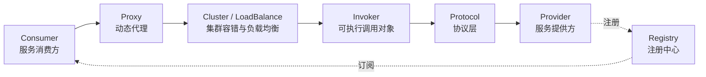
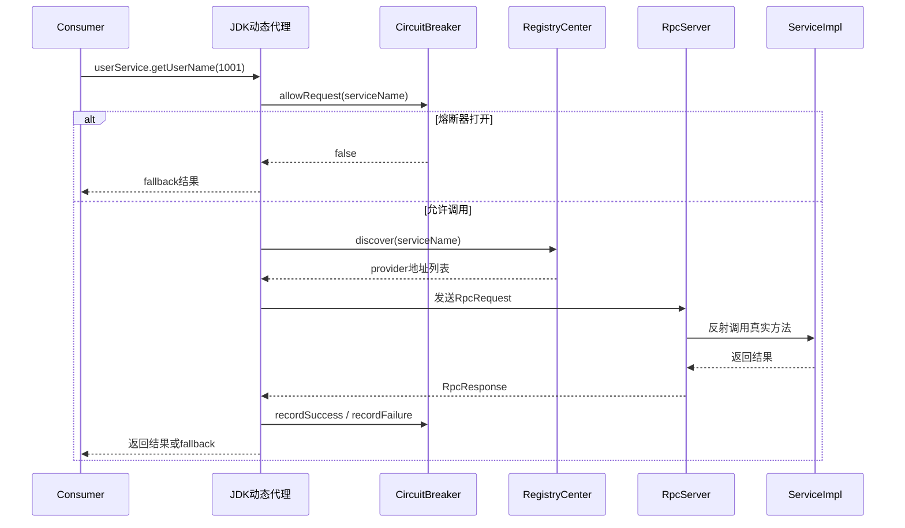

本文会参考 Dubbo 的整体设计思路，手写一个极简版 RPC 框架。

它不会像 Dubbo 那样把协议、注册中心、集群容错、SPI 扩展、线程模型都做得非常完整，但会把 RPC 最核心的一条链路跑通，并且补上一个生产中很重要的能力：**熔断降级**。

也就是说，本文最后实现出来的效果大概是这样的：

1. 服务提供方通过 `RpcServer` 暴露接口实现类
2. 服务消费方通过 `RpcClient` 拿到一个接口代理对象
3. 调用本地接口方法时，底层自动转换成一次网络请求
4. 注册中心负责保存服务名和服务地址的映射关系
5. 客户端通过负载均衡选择一个 Provider
6. 当远程调用持续失败时，熔断器打开，后续请求直接走降级逻辑

本文源码是为了讲清楚核心原理，所以会故意省略很多工程化细节，比如复杂序列化、连接池、异步调用、线程池隔离、泛化调用等。你可以把它理解成一个“麻雀虽小，五脏能看见”的 Mini Dubbo。


## RPC到底解决了什么问题？

假设现在我们有一个订单服务，它需要查询用户信息。

如果两个模块都在同一个 JVM 中，那调用会非常简单：

```java
User user = userService.getUserById(1L);
```

但是微服务拆分之后，`OrderService` 和 `UserService` 可能已经不在同一个进程里了，甚至不在同一台机器上。

这时消费方真正要做的事情其实变成了：

1. 找到 `UserService` 部署在哪台机器
2. 按照某种协议组装请求
3. 通过网络发送请求
4. 服务端解析请求，找到对应实现类和方法
5. 执行真实方法
6. 把结果序列化后返回
7. 客户端再把结果反序列化成本地对象

如果每个业务都自己写这一套，那代码很快就会变成一锅“网络编程大乱炖”。RPC 框架要做的事情，就是把这些细节封装起来，让远程调用看起来像本地调用。

Dubbo 的核心价值也是如此：屏蔽远程调用细节，提供服务治理能力。

## 从Dubbo视角看一次RPC调用

在 Dubbo 中，一次调用大体会经过下面这些角色：


上图可以先帮我们建立一个整体印象：Consumer 调用接口方法，代理对象把方法调用包装成 `RpcRequest`，然后经过注册发现、网络发送、服务端反射调用，最后再把 `RpcResponse` 返回给业务代码。



我们这篇文章不会完全照搬 Dubbo 的源码结构，但会借鉴它的几个关键思想：

1. **服务暴露**：Provider 启动时，把接口名和服务地址注册到注册中心
2. **服务引用**：Consumer 启动时，从注册中心拿到可用 Provider 地址
3. **动态代理**：业务代码调用接口方法，实际由代理对象发起远程调用
4. **协议封装**：请求和响应都包装成统一对象
5. **集群容错**：远程调用失败时不能一直傻等，要能快速失败、熔断、降级

为了让代码更容易看懂，我们用 JDK 原生 socket + JDK 序列化来模拟网络通信。

真实项目中不建议直接这么干。Dubbo 默认协议基于长连接和高性能编解码，注册中心也通常使用 ZooKeeper、Nacos、Redis 等组件。

## 先定义业务接口

先从业务方的视角看，我们希望最终使用起来足够简单。

服务接口：

```java
public interface UserService {
    String getUserName(Long userId);
}
```

服务实现类：

```java
public class UserServiceImpl implements UserService {

    @Override
    public String getUserName(Long userId) {
        return "seven-" + userId;
    }
}
```

Provider 暴露服务：

```java
public class ProviderApplication {

    public static void main(String[] args) {
        RpcServer rpcServer = new RpcServer(9000);
        rpcServer.registerService(UserService.class, new UserServiceImpl());
        rpcServer.start();
    }
}
```

Consumer 调用服务：

```java
public class ConsumerApplication {

    public static void main(String[] args) {
        RpcClient rpcClient = new RpcClient();

        UserService userService = rpcClient.getProxy(
                UserService.class,
                () -> "默认用户"
        );

        String result = userService.getUserName(1001L);
        System.out.println(result);
    }
}
```

注意这里的 `userService.getUserName(1001L)` 看起来是一次普通的本地方法调用，但实际上它会被代理对象拦截，然后变成一次远程调用。

这就是 RPC 最迷人的地方：**用本地调用的写法，完成远程调用的事情**。

## 工程结构

我们这个 Mini RPC 可以拆成下面几个核心类：

```text
mini-rpc
├── RpcRequest          // 请求对象
├── RpcResponse         // 响应对象
├── RegistryCenter      // 简化注册中心
├── RpcServer           // 服务提供方
├── RpcClient           // 服务消费方
├── CircuitBreaker      // 熔断器
├── FallbackFactory     // 降级逻辑
├── UserService         // 业务接口
└── UserServiceImpl     // 业务实现
```

这几个类刚好对应一次 RPC 调用中最核心的几个动作：请求封装、服务注册、服务发现、远程通信、反射调用、失败保护。

## 请求和响应对象

既然要通过网络调用远程方法，那客户端必须告诉服务端：

1. 要调用哪个接口
2. 要调用哪个方法
3. 方法参数类型是什么
4. 方法参数值是什么

所以先定义 `RpcRequest`：

```java
import java.io.Serializable;

public class RpcRequest implements Serializable {
    private String interfaceName;
    private String methodName;
    private Class<?>[] parameterTypes;
    private Object[] args;

    public RpcRequest(String interfaceName, String methodName,
                      Class<?>[] parameterTypes, Object[] args) {
        this.interfaceName = interfaceName;
        this.methodName = methodName;
        this.parameterTypes = parameterTypes;
        this.args = args;
    }

    public String getInterfaceName() {
        return interfaceName;
    }

    public String getMethodName() {
        return methodName;
    }

    public Class<?>[] getParameterTypes() {
        return parameterTypes;
    }

    public Object[] getArgs() {
        return args;
    }
}
```

再定义 `RpcResponse`：

```java
import java.io.Serializable;

public class RpcResponse implements Serializable {
    private Object data;
    private Exception exception;

    public static RpcResponse success(Object data) {
        RpcResponse response = new RpcResponse();
        response.data = data;
        return response;
    }

    public static RpcResponse fail(Exception exception) {
        RpcResponse response = new RpcResponse();
        response.exception = exception;
        return response;
    }

    public Object getData() {
        return data;
    }

    public Exception getException() {
        return exception;
    }
}
```

这两个类就相当于 RPC 协议中的“信封”。

请求信封里装着“我要调谁、调哪个方法、参数是什么”；响应信封里装着“调用结果或者异常”。

## 简化版注册中心

Dubbo 中的注册中心一般会用 ZooKeeper、Nacos、Redis 等外部组件。Provider 启动时把自己注册上去，Consumer 订阅服务地址变更。


为了方便理解，我们先用一个本地内存 Map 来模拟注册中心：

```java
import java.util.*;
import java.util.concurrent.ConcurrentHashMap;

public class RegistryCenter {

    private static final Map<String, List<String>> SERVICE_MAP =
            new ConcurrentHashMap<>();

    public static void register(String serviceName, String address) {
        SERVICE_MAP.computeIfAbsent(serviceName, key -> new ArrayList<>())
                .add(address);
    }

    public static List<String> discover(String serviceName) {
        return SERVICE_MAP.getOrDefault(serviceName, Collections.emptyList());
    }
}
```

这里的 `serviceName` 可以简单理解为接口全限定名，比如：

```java
com.seven.rpc.UserService
```

`address` 可以是：

```text
127.0.0.1:9000
```

真实 Dubbo 中，注册中心保存的不只是地址，还包括版本号、分组、权重、协议、应用名、方法级配置等很多元数据。

我们这里先保留最核心的服务发现能力即可。

## 服务提供方：暴露服务

Provider 要做的事情也比较明确：

1. 保存接口和实现类的映射关系
2. 把服务地址注册到注册中心
3. 启动端口监听客户端请求
4. 收到请求后反射调用真实对象
5. 把执行结果返回给客户端

代码如下：

```java
import java.io.ObjectInputStream;
import java.io.ObjectOutputStream;
import java.lang.reflect.Method;
import java.net.ServerSocket;
import java.net.Socket;
import java.util.Map;
import java.util.concurrent.ConcurrentHashMap;

public class RpcServer {

    private final int port;
    private final Map<String, Object> serviceMap = new ConcurrentHashMap<>();

    public RpcServer(int port) {
        this.port = port;
    }

    public void registerService(Class<?> interfaceClass, Object serviceImpl) {
        String serviceName = interfaceClass.getName();
        serviceMap.put(serviceName, serviceImpl);
        RegistryCenter.register(serviceName, "127.0.0.1:" + port);
    }

    public void start() {
        try (ServerSocket serverSocket = new ServerSocket(port)) {
            System.out.println("rpc server started, port = " + port);

            while (true) {
                Socket socket = serverSocket.accept();
                new Thread(() -> handle(socket)).start();
            }
        } catch (Exception e) {
            throw new RuntimeException(e);
        }
    }

    private void handle(Socket socket) {
        try (
                ObjectInputStream input = new ObjectInputStream(socket.getInputStream());
                ObjectOutputStream output = new ObjectOutputStream(socket.getOutputStream())
        ) {
            RpcRequest request = (RpcRequest) input.readObject();
            Object service = serviceMap.get(request.getInterfaceName());

            if (service == null) {
                output.writeObject(RpcResponse.fail(
                        new RuntimeException("service not found: " + request.getInterfaceName())
                ));
                return;
            }

            Method method = service.getClass().getMethod(
                    request.getMethodName(),
                    request.getParameterTypes()
            );

            Object result = method.invoke(service, request.getArgs());
            output.writeObject(RpcResponse.success(result));
        } catch (Exception e) {
            try {
                ObjectOutputStream output = new ObjectOutputStream(socket.getOutputStream());
                output.writeObject(RpcResponse.fail(e));
            } catch (Exception ignored) {
            }
        }
    }
}
```

这段代码就是服务暴露的最小实现。

如果类比 Dubbo，那么 `registerService()` 类似服务导出时做的事情，而 `start()` 里面处理请求的逻辑，则类似协议层收到请求后转交给 Invoker 执行。

当然，真实 Dubbo 肯定不会为每个请求都直接 new 一个线程，也不会使用 JDK 原生序列化。这里这样写只是为了把核心流程摊开。

## 服务消费方：动态代理

现在服务端已经能接收请求了，接下来就要让客户端调用远程服务。

我们希望使用者这样写：

```java
UserService userService = rpcClient.getProxy(UserService.class, () -> "默认用户");
String name = userService.getUserName(1L);
```

它看起来像是在调用本地接口，但实际上 `userService` 是 JDK 动态代理生成出来的对象。

`RpcClient` 的核心逻辑如下：

```java
import java.io.ObjectInputStream;
import java.io.ObjectOutputStream;
import java.lang.reflect.Proxy;
import java.net.Socket;
import java.util.List;
import java.util.concurrent.ThreadLocalRandom;
import java.util.function.Supplier;

public class RpcClient {

    private final CircuitBreaker circuitBreaker = new CircuitBreaker(3, 5000);

    @SuppressWarnings("unchecked")
    public <T> T getProxy(Class<T> interfaceClass, Supplier<Object> fallback) {
        return (T) Proxy.newProxyInstance(
                interfaceClass.getClassLoader(),
                new Class[]{interfaceClass},
                (proxy, method, args) -> {
                    String serviceName = interfaceClass.getName();

                    if (!circuitBreaker.allowRequest(serviceName)) {
                        return fallback.get();
                    }

                    RpcRequest request = new RpcRequest(
                            serviceName,
                            method.getName(),
                            method.getParameterTypes(),
                            args
                    );

                    try {
                        Object result = doInvoke(serviceName, request);
                        circuitBreaker.recordSuccess(serviceName);
                        return result;
                    } catch (Exception e) {
                        circuitBreaker.recordFailure(serviceName);
                        return fallback.get();
                    }
                }
        );
    }

    private Object doInvoke(String serviceName, RpcRequest request) throws Exception {
        List<String> addressList = RegistryCenter.discover(serviceName);
        if (addressList.isEmpty()) {
            throw new RuntimeException("no provider for service: " + serviceName);
        }

        String address = select(addressList);
        String[] arr = address.split(":");

        try (
                Socket socket = new Socket(arr[0], Integer.parseInt(arr[1]));
                ObjectOutputStream output = new ObjectOutputStream(socket.getOutputStream());
                ObjectInputStream input = new ObjectInputStream(socket.getInputStream())
        ) {
            output.writeObject(request);
            output.flush();

            RpcResponse response = (RpcResponse) input.readObject();
            if (response.getException() != null) {
                throw response.getException();
            }
            return response.getData();
        }
    }

    private String select(List<String> addressList) {
        int index = ThreadLocalRandom.current().nextInt(addressList.size());
        return addressList.get(index);
    }
}
```

这里面有三个重点。

第一个重点是动态代理。

业务方调用接口方法时，实际会进入 `InvocationHandler`，我们在这里把本地方法调用转换成 `RpcRequest`。

第二个重点是服务发现。

客户端不会把 Provider 地址写死，而是先通过 `RegistryCenter.discover(serviceName)` 找到可用服务地址。

第三个重点是熔断降级。

每次远程调用之前，先问熔断器：这个服务现在还能不能调？如果不能调，就不再发网络请求，直接走 fallback。

## 为什么RPC框架必须考虑熔断降级？

很多人在手写 RPC 的时候，只写到动态代理 + Socket 调用就结束了。

但如果从真实生产环境来看，这还远远不够。

原因很简单：远程调用不是本地调用。

本地调用大多数时候只有代码异常，而远程调用还会多出很多不确定因素：

1. 网络抖动
2. Provider 宕机
3. Provider 线程池打满
4. 注册中心数据延迟
5. 下游接口响应变慢
6. Consumer 请求堆积

如果没有熔断，下游服务一旦变慢，上游服务就会一直等待，线程越积越多，最后可能把自己也拖死。

这就是典型的服务雪崩。

熔断器要做的事情，就是在连续失败达到阈值后，短时间内直接拒绝请求，让调用方快速失败或者走降级逻辑。

## 熔断器状态机

我们实现一个最经典的三状态熔断器：


三个状态的含义如下：

| 状态 | 含义 | 处理方式 |
| --- | --- | --- |
| CLOSED | 熔断器关闭，服务正常调用 | 允许请求通过 |
| OPEN | 熔断器打开，下游疑似不可用 | 直接走降级 |
| HALF_OPEN | 半开状态，尝试放行一次探测请求 | 成功则恢复，失败则继续熔断 |

这个模型和 Hystrix、Resilience4j 等熔断组件的思想类似。Dubbo 生态中也能通过集群容错策略、Filter、Sentinel 等方式实现类似效果。

## 手写CircuitBreaker

下面是我们的简化版熔断器：

```java
import java.util.Map;
import java.util.concurrent.ConcurrentHashMap;
import java.util.concurrent.atomic.AtomicInteger;

public class CircuitBreaker {

    enum State {
        CLOSED,
        OPEN,
        HALF_OPEN
    }

    static class Circuit {
        private State state = State.CLOSED;
        private final AtomicInteger failureCount = new AtomicInteger(0);
        private long lastFailureTime;
    }

    private final int failureThreshold;
    private final long retryIntervalMs;
    private final Map<String, Circuit> circuitMap = new ConcurrentHashMap<>();

    public CircuitBreaker(int failureThreshold, long retryIntervalMs) {
        this.failureThreshold = failureThreshold;
        this.retryIntervalMs = retryIntervalMs;
    }

    public boolean allowRequest(String serviceName) {
        Circuit circuit = circuitMap.computeIfAbsent(serviceName, key -> new Circuit());

        if (circuit.state == State.CLOSED) {
            return true;
        }

        if (circuit.state == State.OPEN) {
            long now = System.currentTimeMillis();
            if (now - circuit.lastFailureTime > retryIntervalMs) {
                circuit.state = State.HALF_OPEN;
                return true;
            }
            return false;
        }

        return true;
    }

    public void recordSuccess(String serviceName) {
        Circuit circuit = circuitMap.computeIfAbsent(serviceName, key -> new Circuit());
        circuit.failureCount.set(0);
        circuit.state = State.CLOSED;
    }

    public void recordFailure(String serviceName) {
        Circuit circuit = circuitMap.computeIfAbsent(serviceName, key -> new Circuit());
        int count = circuit.failureCount.incrementAndGet();
        circuit.lastFailureTime = System.currentTimeMillis();

        if (count >= failureThreshold) {
            circuit.state = State.OPEN;
        }
    }
}
```

这段代码的逻辑并不复杂。

当状态是 `CLOSED` 时，说明服务目前是健康的，请求可以正常通过。

当状态是 `OPEN` 时，说明服务已经连续失败多次，此时请求会被快速拒绝，直接走降级逻辑。

当 `OPEN` 状态持续一段时间后，熔断器会进入 `HALF_OPEN`，放行一次探测请求。如果这次请求成功，说明服务可能恢复了，状态改回 `CLOSED`；如果失败，则再次回到 `OPEN`。

这里有一个细节：我们的熔断维度是 `serviceName`。

也就是说，不同服务有不同的熔断状态。`UserService` 挂了，不应该影响 `OrderService` 的调用。

## 降级逻辑怎么接入？

降级不是“报错吞掉”这么简单。

更准确地说，降级是当远程服务不可用时，给调用方一个可接受的兜底结果。

比如用户服务不可用时：

```java
UserService userService = rpcClient.getProxy(
        UserService.class,
        () -> "默认用户"
);
```

如果远程调用失败，或者熔断器已经打开，那么 `getUserName()` 就会返回 `"默认用户"`。

这种写法对应到真实业务里，可以有很多变种：

1. 查用户失败时返回匿名用户
2. 查商品推荐失败时返回默认推荐列表
3. 查库存失败时提示稍后重试
4. 查营销活动失败时直接不展示活动入口

Dubbo 本身也有 mock、cluster 容错、filter 扩展等机制，可以实现类似的降级效果。生产中更常见的做法是结合 Sentinel、Resilience4j 或自研治理平台统一管理。

## 把整条调用链串起来

现在我们把 Mini RPC 的核心调用链完整串一下：



这一条链路，其实就是 RPC 的主干。

后续你再往上加功能，比如超时、重试、权重负载均衡、心跳、连接池、异步调用，本质上都是在这条主干上继续加枝叶。

## 模拟一次熔断效果

为了看到熔断效果，我们可以先启动 Provider，然后正常调用。

```java
UserService userService = rpcClient.getProxy(
        UserService.class,
        () -> "默认用户"
);

for (int i = 0; i < 10; i++) {
    System.out.println(userService.getUserName((long) i));
}
```

正常情况下会输出：

```text
seven-0
seven-1
seven-2
seven-3
...
```

然后我们把 Provider 停掉，再执行 Consumer。

前三次会尝试真正发起远程调用，但是因为服务不可用会失败。连续失败达到阈值后，熔断器打开，后续请求不再访问网络，而是直接走 fallback。

输出大概是：

```text
默认用户
默认用户
默认用户
默认用户
...
```

看起来都是降级结果，但内部区别很大。

前三次是“尝试远程调用失败后降级”，后面是“熔断器直接拒绝后降级”。

后者对系统保护更强，因为它避免了无意义的网络等待。

## 这个版本和Dubbo还有哪些差距？

到这里，一个简化版 RPC 框架已经可以跑通了。

但如果和 Dubbo 相比，它仍然非常简陋。

Dubbo 至少还做了这些事情：

1. **协议层**：Dubbo Protocol、Triple、REST 等多协议支持
2. **序列化**：Hessian、Fastjson2、Kryo、Protobuf 等
3. **注册中心**：ZooKeeper、Nacos、Redis、Consul 等
4. **负载均衡**：随机、轮询、最少活跃数、一致性 Hash 等
5. **集群容错**：Failover、Failfast、Failsafe、Failback、Forking 等
6. **扩展机制**：基于 SPI 的插件化扩展
7. **服务治理**：路由、限流、权重、标签、灰度、动态配置
8. **调用链增强**：Filter、Invoker、Directory、ClusterInvoker 等抽象

所以本文这个版本更适合理解 RPC 的骨架，而不是直接拿去生产使用。

不过它已经包含了 RPC 最关键的几个知识点：动态代理、网络通信、反射调用、注册发现、负载均衡、熔断降级。

## 从源码角度再理解Dubbo

如果你后面再去看 Dubbo 源码，可以带着本文的几个简化类去对照。

| Mini RPC | Dubbo中类似角色 | 作用 |
| --- | --- | --- |
| `RpcClient` | ReferenceConfig / ProxyFactory | 创建远程服务代理 |
| `RpcServer` | ServiceConfig / Protocol.export | 服务暴露 |
| `RegistryCenter` | Registry / Directory | 服务注册与发现 |
| `RpcRequest` | Invocation / Request | 描述一次调用 |
| `RpcResponse` | Result / Response | 描述一次返回 |
| `select()` | LoadBalance | 从多个Provider中选一个 |
| `CircuitBreaker` | Cluster容错 / Filter / Sentinel | 失败保护与服务治理 |

Dubbo 的源码之所以看起来复杂，是因为它把每个扩展点都抽象得很细。

比如一次调用不是直接从代理对象打到网络层，而是会经过 Proxy、Invoker、Cluster、Directory、Router、LoadBalance、Filter、Protocol、ExchangeClient 等多个层次。

但如果你把这些层次压缩一下，就会发现核心问题仍然是本文这几个：

1. 调用谁？
2. 去哪里调用？
3. 怎么编码和发送？
4. 失败了怎么办？
5. 下游不稳定时如何保护自己？

## 小结

本文用一个极简版本模拟了 RPC 框架的核心实现。

整体流程可以总结为：

1. Provider 启动后注册服务
2. Consumer 通过接口生成代理对象
3. 代理对象把本地方法调用包装成 `RpcRequest`
4. 客户端从注册中心拿到 Provider 地址
5. 通过 Socket 把请求发送到服务端
6. 服务端根据接口名和方法名反射调用真实实现类
7. 服务端返回 `RpcResponse`
8. 客户端拿到结果后返回给业务代码
9. 如果调用失败次数过多，熔断器打开，后续请求直接走降级

如果说 RPC 的基础能力是“让远程调用像本地调用一样简单”，那熔断降级解决的就是另一个更现实的问题：**当远程调用不可靠时，如何让系统尽量不要一起倒下**。

这也是为什么真正的 RPC 框架，从来不只是封装网络请求这么简单。

它本质上是在解决分布式系统里的不确定性。
